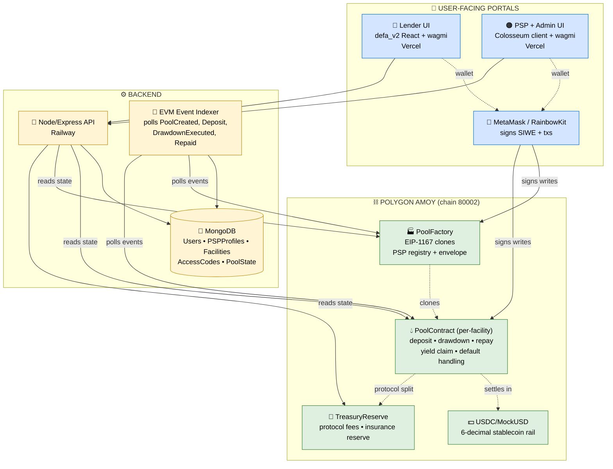
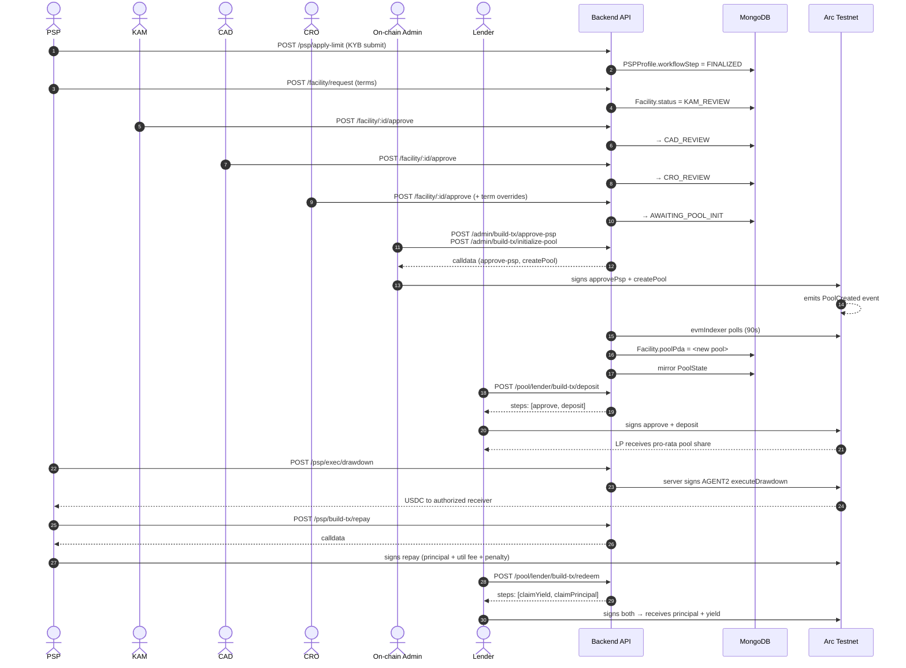
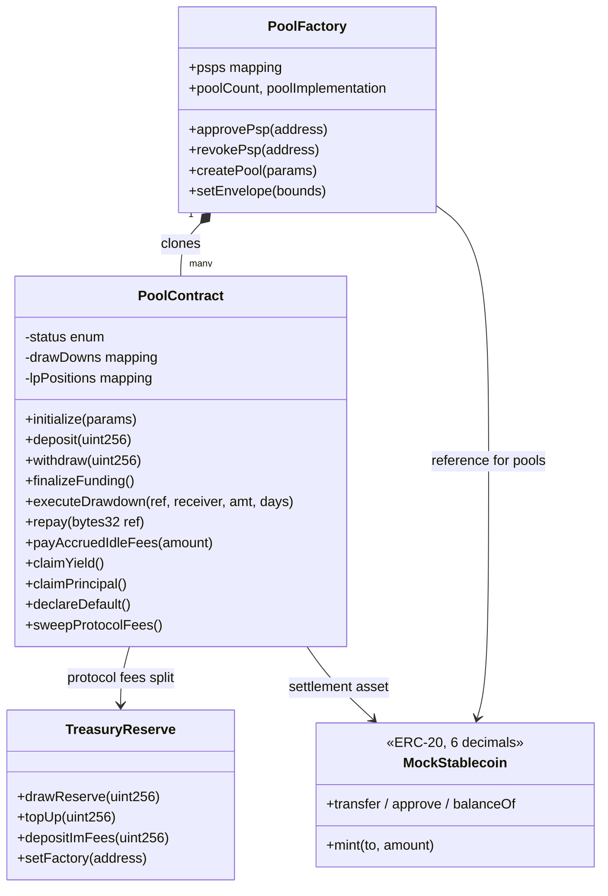

# DeFa — System Architecture

*Ignyte Stablecoins Commerce Stack Challenge submission — deployed on Arc Testnet (chain 5042002).*

DeFa is on-chain credit operating infrastructure for SME trade finance. LPs deposit stablecoins, PSPs / SMEs draw against verified receivables, KAM → CAD → CRO → Legal approvals gate every facility, on-chain admin signs pool deployment. Automated repayment waterfalls, tiered risk pools, and cleaner on-chain accounting than legacy trade-credit rails.

## Top-level architecture



## Facility lifecycle (KAM → CAD → CRO → Legal → On-chain Admin)



## Contract set (payfi_v1)



## Deployed on Arc Testnet (chain 5042002)

| Contract | Address | Explorer |
|---|---|---|
| **PoolFactory** | `0x4e39880B43f9a83586a2aC75a01dff779Eb958c0` | [testnet.arcscan.app](https://testnet.arcscan.app/address/0x4e39880B43f9a83586a2aC75a01dff779Eb958c0) |
| **MockUSD** | `0x2b2037760695772770182C84dFeE2b9594526c7f` | [testnet.arcscan.app](https://testnet.arcscan.app/address/0x2b2037760695772770182C84dFeE2b9594526c7f) |
| **TreasuryReserve** | `0xcC3a9A71532a1402Ab57742C22661eE6e96102e5` | [testnet.arcscan.app](https://testnet.arcscan.app/address/0xcC3a9A71532a1402Ab57742C22661eE6e96102e5) |

**3 demo facilities live on-chain**: Mercury Settlements USDC Facility (12% APR, Medium risk), Aurum Cross-Border Corridor (6% APR, Low risk), Meridian FX Working Capital (14% APR, Medium risk).

## Repo structure

```
├── client/           v2 lender UI  (React 19 + Vite + Tailwind v4 + wagmi + RainbowKit)
├── client-legacy/    PSP + admin portals (KAM/CAD/CRO/Legal/onchain-admin)
├── server/           Node/Express + Mongoose + ethers v6
│   ├── routes/       18 route files — auth, facility, poolTx, admin, faucet, etc.
│   ├── services/     poolServiceEvm (ethers client), walletAuthEvm (SIWE)
│   ├── workers/      evmIndexer (polls PoolCreated + DrawdownExecuted + Repaid)
│   └── test/         38-test suite (e2eFlows + lifecycleFlows + onchainFlows)
├── contracts/        Foundry payfi_v1 (7 Solidity sources, ~17K LOC test coverage)
└── docs/             This file, LOCAL_E2E, DEPLOYMENT
```

## Test coverage

**76 integration tests across two testnets, 38 per chain, all green.**

| Suite | Amoy | Arc |
|---|---|---|
| `e2eFlows.test.js` (auth, marketplace, deposit, faucet, gates, stubs) | 18/18 ✅ | 18/18 ✅ |
| `lifecycleFlows.test.js` (PSP → KAM → CAD → CRO → onchain admin) | 13/13 ✅ | 13/13 ✅ |
| `onchainFlows.test.js` (real approvePsp + createPool + faucet mint + BE state read) | 7/7 ✅ | 7/7 ✅ |
